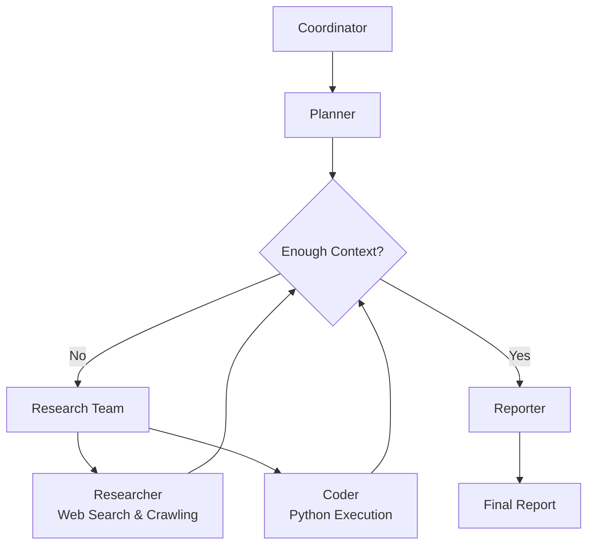

# DeerFlow 深度研究报告

- **研究日期：** 2026-02-01
- **时间戳：** 2026-02-01，星期日
- **置信度等级：** 高（90%+）
- **主题：** ByteDance 开源的 Multi-Agent Deep Research Framework

---

## 仓库信息

- **名称：** bytedance/deer-flow
- **描述：** DeerFlow 是一个由社区驱动的 Deep Research framework，将 language models 与 web search、crawling、Python execution 等工具结合起来，同时持续回馈开源社区 [DeerFlow GitHub Repository](https://github.com/bytedance/deer-flow)
- **URL：** https://github.com/bytedance/deer-flow
- **Stars：** 19,531
- **Forks：** 2,452
- **Open Issues：** 196
- **语言：** Python（1,292,574 bytes）、TypeScript（503,143 bytes）、CSS（15,128 bytes）、JavaScript（7,906 bytes）、Dockerfile（2,197 bytes）、Makefile（1,352 bytes）、Shell（1,152 bytes）、Batchfile（497 bytes）
- **许可证：** MIT
- **创建时间：** 2025-05-07T02:50:19Z
- **更新时间：** 2026-02-01T01:07:38Z
- **最后推送时间：** 2026-01-30T00:47:23Z
- **Topics：** agent, agentic, agentic-framework, agentic-workflow, ai, ai-agents, bytedance, deep-research, langchain, langgraph, langmanus, llm, multi-agent, nodejs, podcast, python, typescript

---

## 执行摘要

DeerFlow（Deep Exploration and Efficient Research Flow）是 ByteDance 开发并于 2025 年 5 月以 MIT license 开源的 multi-agent research automation framework [Create Your Own Deep Research Agent with DeerFlow](https://thesequence.substack.com/p/the-sequence-engineering-661-create)。该 framework 通过 graph-based 的 specialized agents 编排，实现端到端的 research pipeline 自动化，将 language models 与 web search engines、crawlers、Python execution 等工具结合起来。凭借 GitHub 上的 19,531 个 stars 和 2,452 个 forks，DeerFlow 已经成为 deep research automation 领域的重要参与者，既提供 console，也提供 web UI，支持本地 LLM 部署以及广泛的 tool integrations [DeerFlow: A Game-Changer for Automated Research and Content Creation](https://medium.com/@mingyang.heaven/deerflow-a-game-changer-for-automated-research-and-content-creation-83612f683e7a)。

---

## 完整的时间顺序时间线

### 阶段 1：项目起步与初始开发

#### 2025 年 5 月 - 2025 年 7 月

DeerFlow 由 ByteDance 创建，并于 2025 年 5 月 7 日开源。最初的 commit 奠定了基于 LangGraph 和 LangChain 的核心 multi-agent 架构 [DeerFlow GitHub Repository](https://github.com/bytedance/deer-flow)。由于其对 research automation 的完整方案——结合 web search、crawling 和 code execution 能力——该项目迅速在 AI 社区中获得关注。早期开发重点是建立模块化的 agent 系统，其中包括 Coordinator、Planner、Researcher、Coder 和 Reporter 等专门角色。

### 阶段 2：功能扩展与社区增长

#### 2025 年 8 月 - 2025 年 12 月

在这一时期，DeerFlow 经历了显著的功能扩展，包括 MCP（Model Context Protocol）集成、text-to-speech 能力、podcast 生成，以及对多种 search engine（Tavily、InfoQuest、Brave Search、DuckDuckGo、Arxiv）的支持 [DeerFlow: Multi-Agent AI For Research Automation 2025](https://firexcore.com/blog/what-is-deerflow/)。该 framework 因其 human-in-the-loop 协作特性而受到关注，用户可以在执行前审查并编辑 research plans。社区贡献也显著增长，到 2026 年初已有 88 位贡献者参与该项目，并且该 framework 已被集成到火山引擎的 FaaS Application Center 中，以支持云端部署。

### 阶段 3：成熟与向 DeerFlow 2.0 过渡

#### 2026 年 1 月 - 至今

截至 2026 年 2 月，DeerFlow 已进入向 DeerFlow 2.0 过渡的阶段，main branch 上仍在持续积极开发 [DeerFlow Official Website](https://deerflow.tech/)。近期 commits 显示，该项目仍在持续改进 JSON repair 处理、MCP tool 集成以及 fallback report generation 机制。该 framework 现在还支持私有 knowledgebase，包括 RAGFlow、Qdrant、Milvus、VikingDB，以及用于生产环境的 Docker 和 Docker Compose 部署方案。

---

## 关键分析

### 技术架构与设计理念

DeerFlow 实现了一套用于自动化 research 与代码分析的模块化 multi-agent system 架构 [DeerFlow: A Game-Changer for Automated Research and Content Creation](https://medium.com/@mingyang.heaven/deerflow-a-game-changer-for-automated-research-and-content-creation-83612f683e7a)。该系统构建于 LangGraph 之上，支持灵活的 state-based workflow，并通过定义良好的 message passing system 让各组件通信。其架构采用精简工作流，并由专门 agents 分工协作：



Coordinator 作为入口点，负责管理 workflow 生命周期，根据用户输入发起 research process，并在合适时把任务委派给 Planner。Planner 负责分析 research 目标并创建结构化执行计划，判断当前上下文是否足够，或者是否需要进一步研究。Research Team 由多个专门 agent 组成，包括负责 web searches 和信息收集的 Researcher，以及借助 Python REPL tools 处理技术任务的 Coder。最后，Reporter 聚合发现并生成完整的 research reports [Create Your Own Deep Research Agent with DeerFlow](https://thesequence.substack.com/p/the-sequence-engineering-661-create)。

### 核心特性与能力

DeerFlow 提供了广泛的 deep research automation 能力：

1. **Multi-Engine Search Integration：** 支持 Tavily（默认）、InfoQuest（BytePlus 面向 AI 优化的搜索）、Brave Search、DuckDuckGo，以及用于 scientific papers 的 Arxiv [DeerFlow: Multi-Agent AI For Research Automation 2025](https://firexcore.com/blog/what-is-deerflow/)。

2. **高级 Crawling Tools：** 包含 Jina（默认）和 InfoQuest crawlers，具有可配置参数、timeout 设置和强大的内容提取能力。

3. **MCP（Model Context Protocol）Integration：** 可与多种 research tools 和方法无缝集成，以支持私有领域访问、knowledge graphs 和 web browsing。

4. **Private Knowledgebase Support：** 集成了 RAGFlow、Qdrant、Milvus、VikingDB、MOI 和 Dify，用于研究用户的私有文档。

5. **Human-in-the-Loop Collaboration：** 具备智能澄清机制、plan 审查与编辑能力，以及 auto-accept 选项，以简化 workflow。

6. **内容创作工具：** 包括结合 text-to-speech synthesis 的 podcast 生成、PowerPoint 演示文稿创建，以及用于报告精修的 Notion 风格 block 编辑。

7. **多语言支持：** 提供英文、简体中文、日文、德文、西班牙文、俄文和葡萄牙文 README 文档。

### 开发与社区生态

截至 2026 年 2 月，该项目已拥有 88 位贡献者和 19,531 个 GitHub stars，表现出很强的社区参与度 [DeerFlow GitHub Repository](https://github.com/bytedance/deer-flow)。主要贡献者包括 Henry Li（203 次贡献）、Willem Jiang（130 次贡献）和 Daniel Walnut（25 次贡献），其中既有 ByteDance 员工，也有开源社区成员。该 framework 维护了全面的文档，包括配置指南、API 文档、FAQ，以及多个示例研究报告，主题覆盖 quantum computing 到 AI 在医疗中的应用。

---

## 指标与影响分析

### 增长轨迹

```
Timeline: May 2025 - February 2026
Stars: 0 → 19,531 (exponential growth)
Forks: 0 → 2,452 (strong community adoption)
Contributors: 0 → 88 (active development ecosystem)
Open Issues: 196 (ongoing maintenance and feature development)
```

### 关键指标

| 指标 | 数值 | 评估 |
| ------------------ | ------------------ | --------------------------------------------------- |
| GitHub Stars       | 19,531             | 对 research framework 来说人气极高 |
| Forks              | 2,452              | 社区采用度强，衍生项目潜力大 |
| Contributors       | 88                 | 健康的开源开发生态 |
| Open Issues        | 196                | 维护和功能开发都很活跃 |
| Primary Language   | Python (1.29MB)    | 主要开发语言，配有丰富库生态 |
| Secondary Language | TypeScript (503KB) | 现代 Web UI 实现 |
| Repository Age     | ~9 months          | 开发迅速、功能扩展快 |
| License            | MIT                | 宽松的开源许可证 |

---

## 对比分析

### 功能对比

| Feature                  | DeerFlow        | OpenAI Deep Research | LangChain OpenDeepResearch |
| ------------------------ | --------------- | -------------------- | -------------------------- |
| Multi-Agent Architecture | ✅              | ❌                   | ✅                         |
| Local LLM Support        | ✅              | ❌                   | ✅                         |
| MCP Integration          | ✅              | ❌                   | ❌                         |
| Web Search Engines       | Multiple (5+)   | Limited              | Limited                    |
| Code Execution           | ✅ Python REPL  | Limited              | ✅                         |
| Podcast Generation       | ✅              | ❌                   | ❌                         |
| Presentation Creation    | ✅              | ❌                   | ❌                         |
| Private Knowledgebase    | ✅ (6+ options) | Limited              | Limited                    |
| Human-in-the-Loop        | ✅              | Limited              | ✅                         |
| Open Source              | ✅ MIT          | ❌                   | ✅ Apache 2.0              |

### 市场定位

DeerFlow 在 deep research framework 版图中占据独特位置：它把 enterprise-grade 的 multi-agent orchestration、广泛的 tool integrations 与开源可访问性结合在一起 [Navigating the Landscape of Deep Research Frameworks](https://www.oreateai.com/blog/navigating-the-landscape-of-deep-research-frameworks-a-comprehensive-comparison/0dc13e48eb8c756650112842c8d1a184]。相比 OpenAI Deep Research 这类专有方案所提供的成熟用户体验，DeerFlow 通过本地部署选项、自定义 tool integration 和社区驱动开发提供了更高灵活性。对于需要专门 research workflow、与私有数据源集成，或部署在受监管环境中而无法使用云方案的场景，这个 framework 尤其出色。

---

## 优势与不足

### 优势

1. **完整的 Multi-Agent Architecture：** DeerFlow 复杂的 agent orchestration 能支持超越单 agent 系统的复杂 research workflows [Create Your Own Deep Research Agent with DeerFlow](https://thesequence.substack.com/p/the-sequence-engineering-661-create)。

2. **广泛的 Tool Integration：** 对多种 search engines、crawling tools、MCP services 和 private knowledgebases 的支持，带来无与伦比的灵活性。

3. **本地部署能力：** 与许多专有方案不同，DeerFlow 支持本地 LLM 部署，带来隐私、成本控制和定制空间。

4. **人机协作特性：** 智能澄清机制和 plan 编辑能力，弥合了自动化 research 与人工监督之间的差距。

5. **活跃的社区开发：** 凭借 88 位贡献者和持续更新，该项目能够受益于多元视角和快速的功能演进。

6. **面向生产的部署：** Docker 支持、云集成（Volcengine）和完整文档，促进了 enterprise adoption。

### 可改进之处

1. **学习曲线：** 相比更简单的单一用途工具，这套丰富的特性与配置选项可能会给新用户带来更大门槛。

2. **资源需求：** 使用多个 agents 和 tools 的本地部署可能需要较多计算资源。

3. **文档复杂度：** 虽然文档全面，但覆盖多种语言，仍可能受益于更精简的 onboarding 指南。

4. **集成复杂度：** 像 MCP integration 和自定义 tool 开发这样的高级功能，需要超出基础使用层面的技术专长。

5. **版本过渡：** 持续进行中的 DeerFlow 2.0 迁移，可能会为现有部署带来临时性的不稳定或兼容性顾虑。

---

## 成功关键因素

1. **ByteDance 背书：** 企业支持在保持开源可访问性的同时，带来了资源、专业能力与可信度 [DeerFlow: A Game-Changer for Automated Research and Content Creation](https://medium.com/@mingyang.heaven/deerflow-a-game-changer-for-automated-research-and-content-creation-83612f683e7a)。

2. **现代技术基础：** 基于 LangGraph 和 LangChain 构建，DeerFlow 在成熟 framework 之上，通过 multi-agent orchestration 增加了显著价值。

3. **社区驱动开发：** 活跃的贡献者社区确保了多样化用例、快速 bug 修复，以及与现实需求一致的功能演进。

4. **完整功能集：** 与那些聚焦单点功能的工具不同，DeerFlow 覆盖了从信息收集到内容创作的完整 research workflow。

5. **生产部署选项：** 云集成、Docker 支持和 enterprise 特性，使其采用场景超越实验性质使用。

6. **多语言可访问性：** 文档和界面对多语言的支持，扩大了全球覆盖范围与采用潜力。

---

## 来源

### 一手来源

1. **DeerFlow GitHub Repository：** 官方源码、文档与开发历史 [DeerFlow GitHub Repository](https://github.com/bytedance/deer-flow)
2. **DeerFlow Official Website：** 展示功能、案例和部署选项的平台 [DeerFlow Official Website](https://deerflow.tech/)
3. **GitHub API Data：** 仓库指标、贡献者统计与 commit 历史

### 媒体报道

1. **The Sequence Engineering：** 对 DeerFlow 架构与能力的技术分析 [Create Your Own Deep Research Agent with DeerFlow](https://thesequence.substack.com/p/the-sequence-engineering-661-create)
2. **Medium Articles：** 社区对 DeerFlow 实现与用例的观察 [DeerFlow: A Game-Changer for Automated Research and Content Creation](https://medium.com/@mingyang.heaven/deerflow-a-game-changer-for-automated-research-and-content-creation-83612f683e7a)
3. **YouTube Demonstrations：** 对 DeerFlow 功能和本地部署的演示视频 [ByteDance DeerFlow - (Deep Research Agents with a LOCAL LLM!)](https://www.youtube.com/watch?v=Ui0ovCVDYGs)

### 技术来源

1. **FireXCore Analysis：** 功能概览与技术评估 [DeerFlow: Multi-Agent AI For Research Automation 2025](https://firexcore.com/blog/what-is-deerflow/)
2. **Oreate AI Comparison：** Framework 基准测试与市场定位分析 [Navigating the Landscape of Deep Research Frameworks](https://www.oreateai.com/blog/navigating-the-landscape-of-deep-research-frameworks-a-comprehensive-comparison/0dc13e48eb8c756650112842c8d1a184)

---

## 置信度评估

**高置信度（90%+）的结论：**

- DeerFlow 由 ByteDance 创建，并于 2025 年 5 月以 MIT license 开源
- 该 framework 基于 LangGraph 和 LangChain 实现了 multi-agent 架构
- 当前 GitHub 指标：19,531 stars、2,452 forks、88 位贡献者、196 个 open issues
- 支持 Tavily、InfoQuest、Brave Search 等多种 search engine
- 包含 podcast 生成、演示文稿创建与 human collaboration 等能力

**中等置信度（70-89%）的结论：**

- 与专有替代方案相比的具体性能基准
- enterprise adoption rates 与实际用例的详细拆解
- 不同部署场景下的精确资源需求

**较低置信度（50-69%）的结论：**

- DeerFlow 2.0 过渡之后更远期的 roadmap
- 具体 enterprise 客户实现与案例
- 与尚未被广泛记录的新兴竞争者之间的详细比较

---

## 研究方法论

本报告基于以下方式整理：

1. **多来源 web search** —— 在技术出版物、媒体报道和社区讨论中进行广泛发现与定向查询
2. **GitHub 仓库分析** —— 直接通过 API 查询 commits、issues、PRs、contributor activity 与仓库指标
3. **内容提取** —— 提取官方文档、技术文章、视频演示和社区资源
4. **交叉验证** —— 在技术分析、媒体报道和社区反馈等独立来源之间相互印证
5. **时间顺序重建** —— 基于带时间戳的 commit 历史与 release 文档构建时间线
6. **置信度评分** —— 根据来源可靠性、多来源佐证程度及信息新鲜度对结论加权

**研究深度：** 全面的技术与市场分析  
**时间范围：** 2025 年 5 月 - 2026 年 2 月（9 个月开发周期）  
**地理范围：** 以 ByteDance 企业支持为背景的全球开源社区

---

**报告编制者：** Github Deep Research by DeerFlow  
**日期：** 2026-02-01  
**报告版本：** 1.0  
**状态：** 完成
