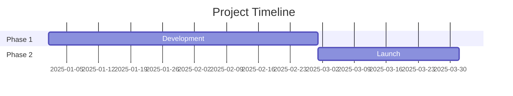
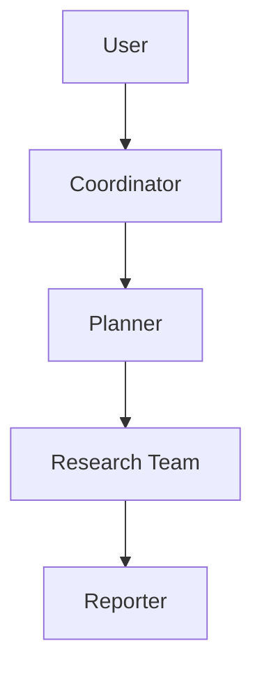
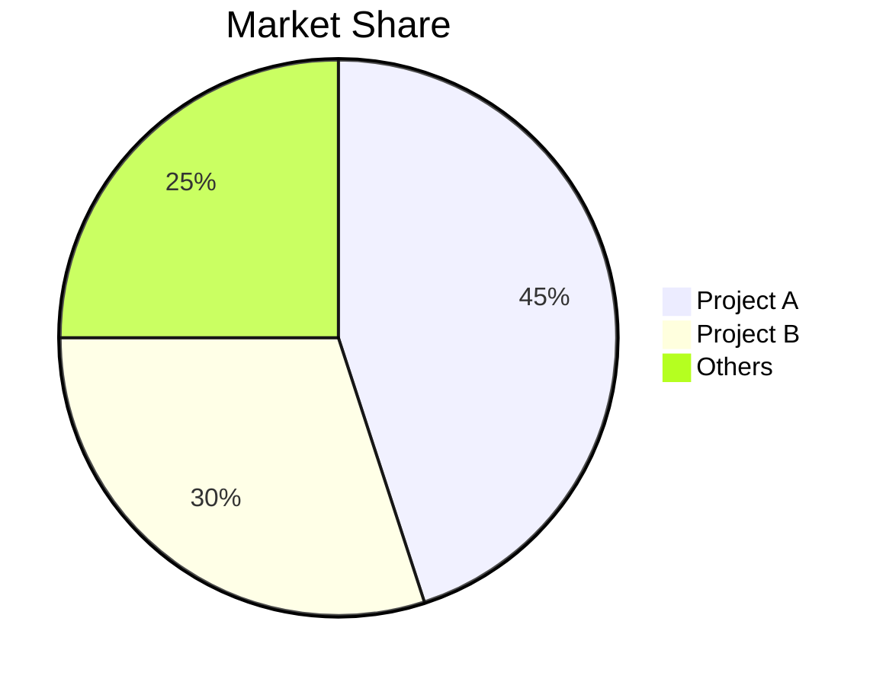

# GitHub 深度研究 Skill

结合 GitHub API、web_search、web_fetch 进行多轮研究，以生成全面的 markdown 报告。

## 研究工作流

- 第 1 轮：GitHub API
- 第 2 轮：发现
- 第 3 轮：深度调查
- 第 4 轮：深入剖析

## 核心方法论

### 查询策略

**由宽到窄**：先从 GitHub API 开始，再进行通用查询，并根据发现逐步细化。

```
Round 1: GitHub API
Round 2: "{topic} overview"
Round 3: "{topic} architecture", "{topic} vs alternatives"
Round 4: "{topic} issues", "{topic} roadmap", "site:github.com {topic}"
```

**来源优先级**：
1. 官方文档/仓库（最高权重）
2. 技术博客（Medium、Dev.to）
3. 新闻文章（已验证媒体）
4. 社区讨论（Reddit、HN）
5. 社交媒体（最低权重，用于情绪/口碑）

### 研究轮次

**第 1 轮 - GitHub API**
直接执行 `scripts/github_api.py`，不要使用 `read_file()`：
```bash
python /path/to/skill/scripts/github_api.py <owner> <repo> summary
python /path/to/skill/scripts/github_api.py <owner> <repo> readme
python /path/to/skill/scripts/github_api.py <owner> <repo> tree
```

**可用命令（`github_api.py` 的最后一个参数）**：
- summary
- info
- readme
- tree
- languages
- contributors
- commits
- issues
- prs
- releases

**第 2 轮 - 发现（3-5 次 web_search）**
- 获取概览并识别关键术语
- 找到官方网站/仓库
- 识别主要参与者/竞争者

**第 3 轮 - 深度调查（5-10 次 web_search + web_fetch）**
- 技术架构细节
- 关键事件时间线
- 社区情绪
- 对有价值的 URL 使用 web_fetch 获取完整内容

**第 4 轮 - 深入剖析**
- 分析 commit 历史以构建时间线
- 审查 issues/PRs 以了解功能演进
- 检查贡献者活跃度

## 报告结构

遵循 `assets/report_template.md` 中的模板：

1. **元数据块** - 日期、置信度级别、主题
2. **执行摘要** - 2-3 句概述并包含关键指标
3. **时间顺序时间线** - 按阶段拆解并附日期
4. **关键分析章节** - 针对主题的深度剖析
5. **指标与比较** - 表格、增长图表
6. **优势与劣势** - 平衡评估
7. **来源** - 分类参考资料
8. **置信度评估** - 按置信度级别列出结论
9. **方法论** - 使用的研究方法

### Mermaid 图表

在有帮助时加入图表：

**时间线（Gantt）**：


**架构（Flowchart）**：


**比较（Pie/Bar）**：


## 置信度评分

根据来源质量分配置信度：

| 置信度 | 标准 |
|------------|----------|
| High (90%+) | 官方文档、GitHub 数据、多个相互印证的来源 |
| Medium (70-89%) | 单个可靠来源、近期文章 |
| Low (50-69%) | 社交媒体、未经验证的说法、过时信息 |

## 输出

将报告保存为：`research_{topic}_{YYYYMMDD}.md`

### 格式规则

- 中文内容：使用全角标点（，。：；！？）
- 技术术语：首次出现时提供 Wiki/文档 URL
- 表格：用于指标、比较
- 代码块：用于技术示例
- Mermaid：用于架构、时间线、流程

## 最佳实践

1. **先从官方来源开始** - 仓库、文档、公司博客
2. **从 commits/PRs 验证日期** - 比文章更可靠
3. **交叉验证说法** - 2 个以上独立来源
4. **注明冲突信息** - 不要隐藏矛盾
5. **区分事实与观点** - 明确标注推测
6. **关键：始终包含行内引用** - 对外部来源的每条陈述，都要在后面立即使用 `[citation:Title](URL)` 格式
7. **从搜索结果中提取 URL** - web_search 返回 {title, url, snippet}，始终使用 URL 字段
8. **边研究边更新** - 不要等到最后才综合整理

### 引用示例

**好 - 带有行内引用：**
```markdown
The project gained 10,000 stars within 3 months of launch [citation:GitHub Stats](https://github.com/owner/repo).
The architecture uses LangGraph for workflow orchestration [citation:LangGraph Docs](https://langchain.com/langgraph).
```

**坏 - 没有引用：**
```markdown
The project gained 10,000 stars within 3 months of launch.
The architecture uses LangGraph for workflow orchestration.
```
